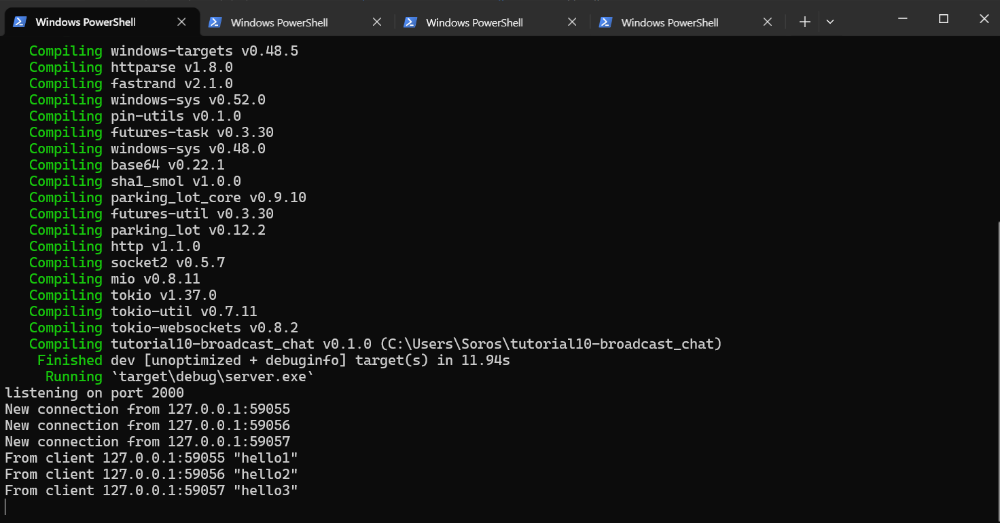
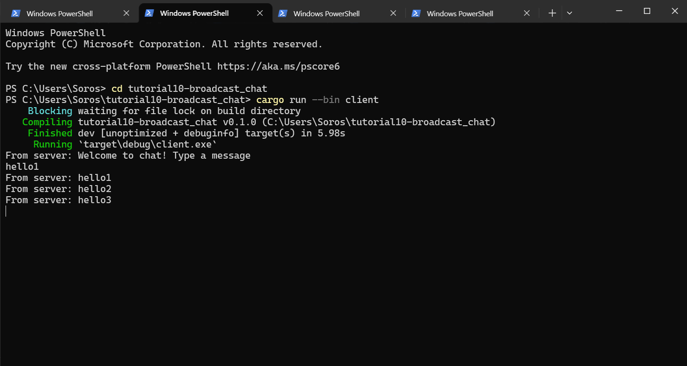
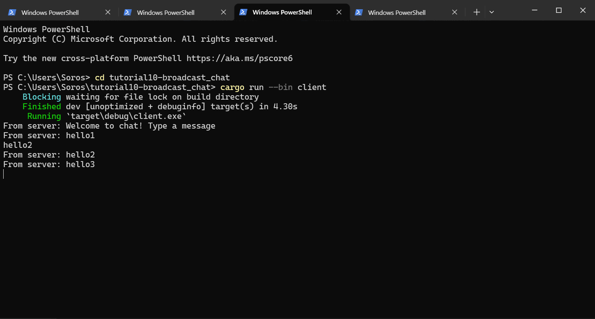
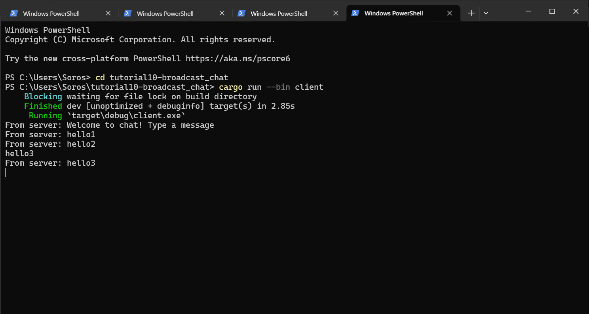
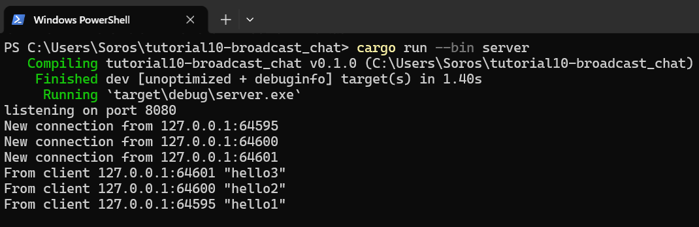
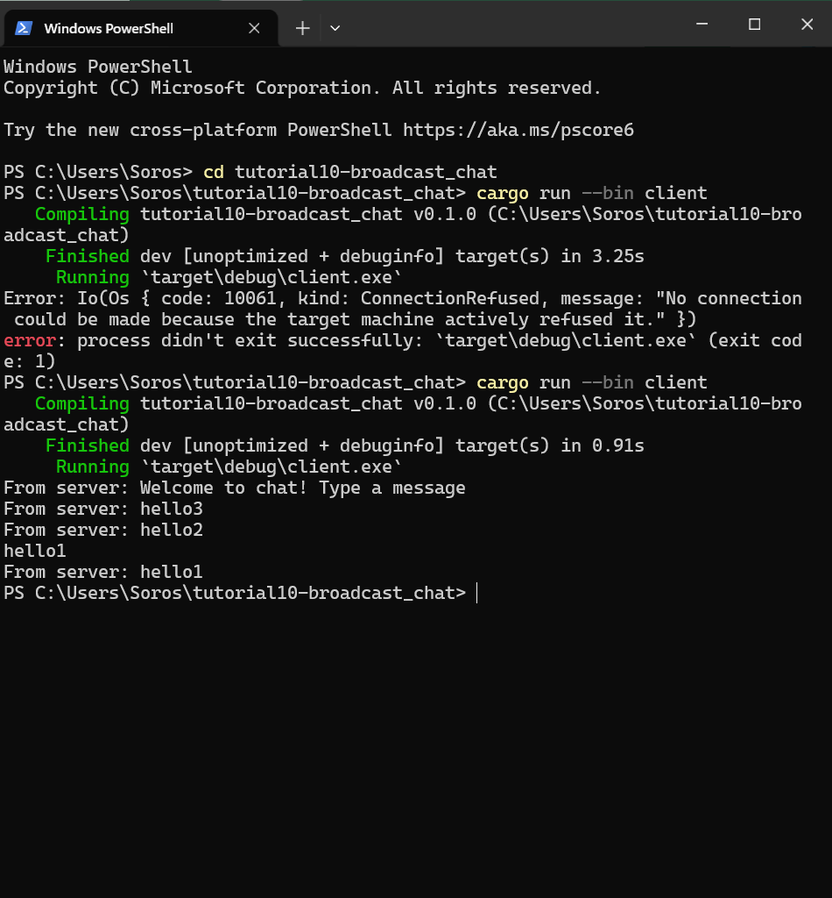
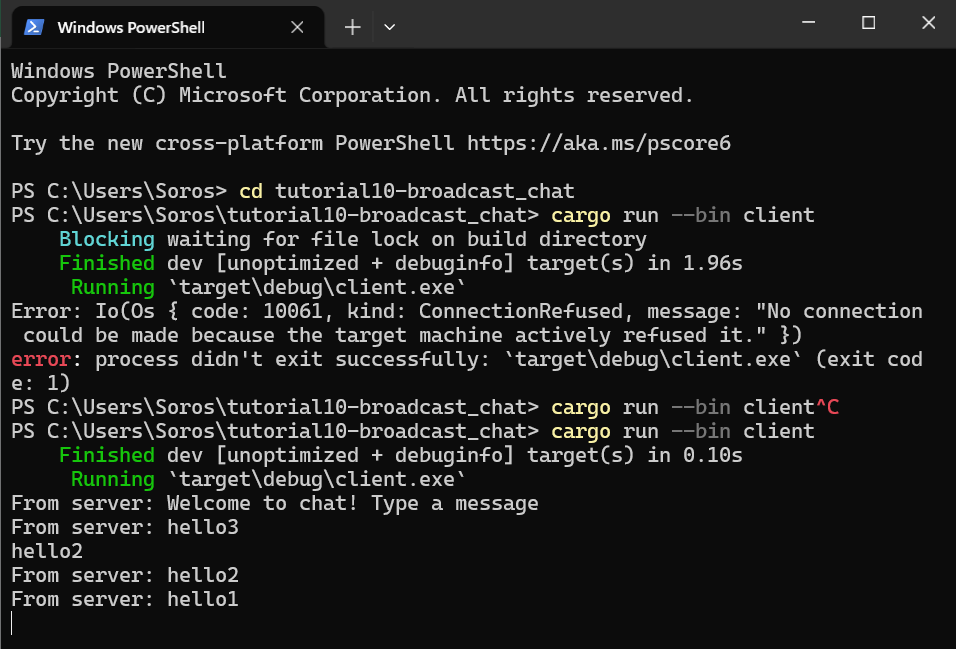
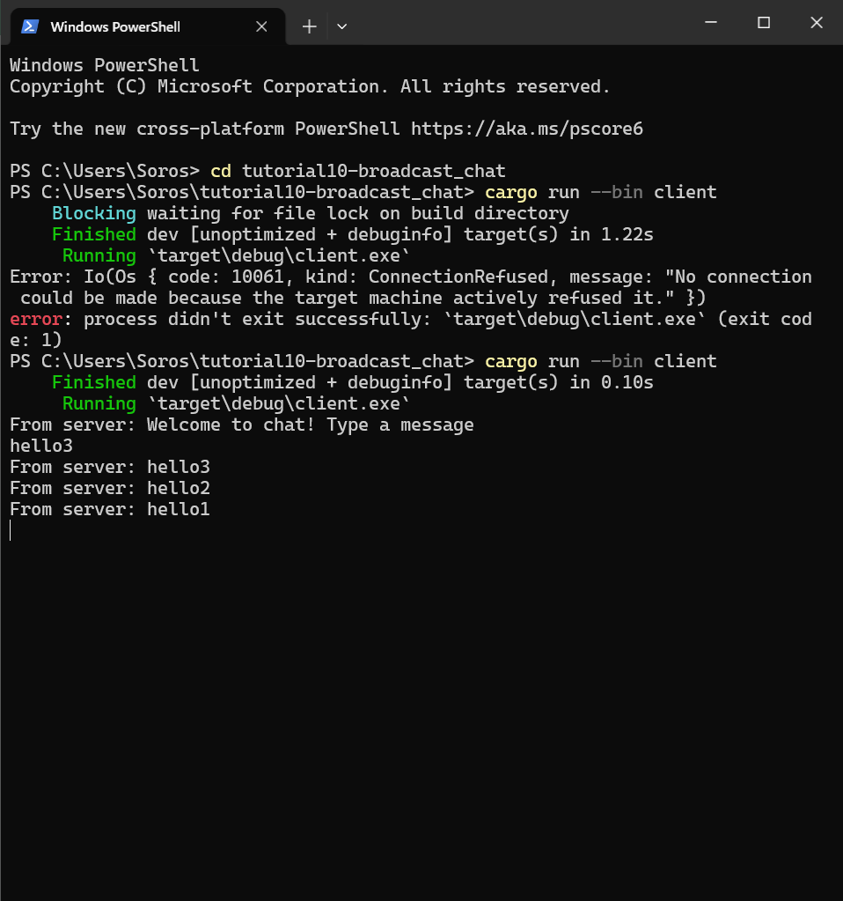
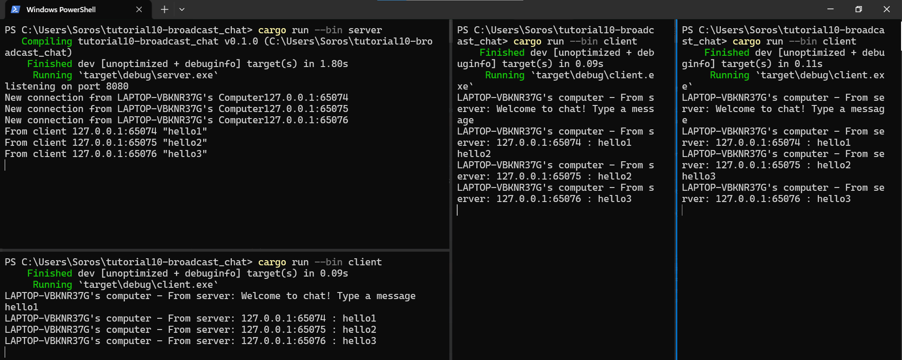

# Module 10 - Asynchronous Programming - Broadcast Chat
> **Soros Febriano** || **2206083445**

## Experiment 2.1: Original code, and how it run

When the clients are ran with `cargo run --bin client` and connected to an active server by running `cargo run --bin server`, the messages sent by a client will be broadcasted across all of the connected clients

## Experiment 2.2: Modifying port

After modifying the port to 8080 at the `client.rs` at line 10:
`ClientBuilder::from_uri(Uri::from_static("ws://127.0.0.1:8080"))` and
`server.rs` at line 48 `let listener = TcpListener::bind("127.0.0.1:8080").await?;`, both components still run smoothly as expected.

## Experiment 2.3: Small changes, add IP and Port

First, add `gethostname` dependency to `Cargo.toml`. 

Then modify add a `hostname` variable like this to the `client.rs` file:
`let hostname = gethostname().into_string().unwrap_or_else(|_| "unknown".to_string());` then edit the message code:

`                    Some(Ok(msg)) => {
                        if let Some(text) = msg.as_text() {
                            println!("{}'s computer - From server: {}", hostname, text);
                        }
                    },`

In the `server.rs` file, modify he bcast message like:

`                    Some(Ok(msg)) => {
                        if let Some(text) = msg.as_text() {
                            println!("From client {addr:?} {text:?}");
                            bcast_tx.send(format!("{addr} : {text}"))?;
                        }
                    }`